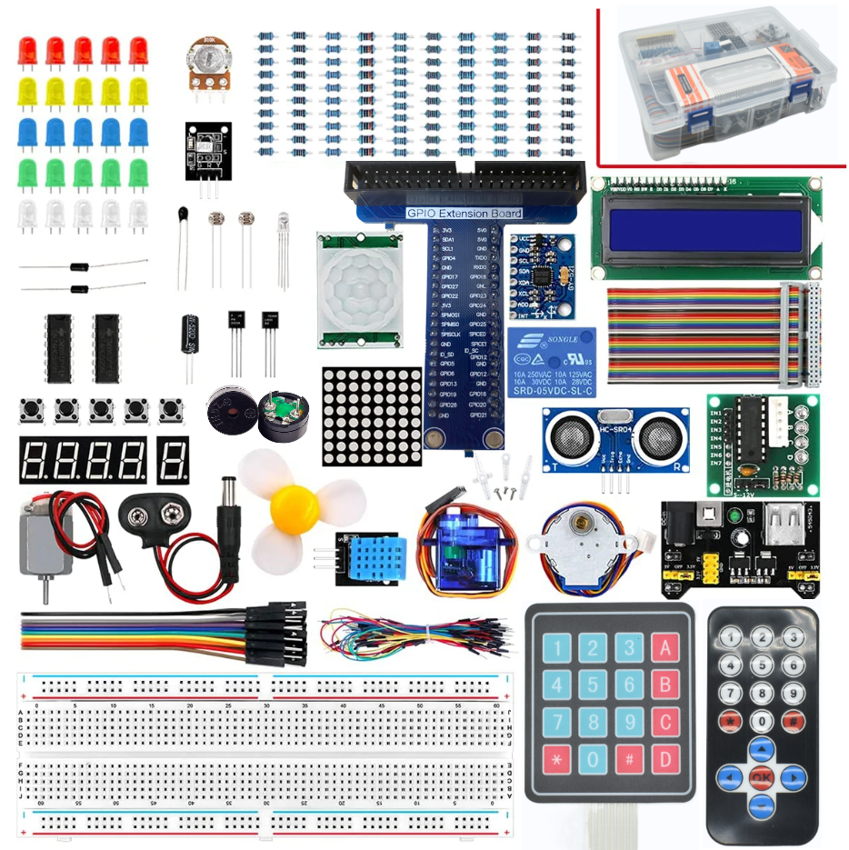

## Super_Starter_Kit_for_Raspberry_Pi_LTARK_24

If you are interested in source code and have the ability to develop it, you can refer to this URL:  

https://github.com/LontenTechnology/Super_Starter_Kit_for_Raspberry_Pi_LTARK_24

### Download

* **Use command in console**

	Run following command to download all the files in this repository.

	`git clone https://github.com/LontenTechnology/Super_Starter_Kit_for_Raspberry_Pi_LTARK_24.git`

* **Manually download in browser**

	Click the green "Clone or download" button, then click "Download ZIP" button in the pop-up window.
	Do NOT click the "Open in Desktop" button, it will lead you to install Github software.

> If you meet any difficulties, please contact our support team for help.

### Support

LONTEN provides free and quick customer support. Including but not limited to:

* Quality problems of products
* Using Problems of products
* Questions of learning and creation
* Opinions and suggestions
* Ideas and thoughts

Please send an email to:

lonten3@qq.com Or Info@lontentech.com

We will reply to you within one working day.

### Purchase

Please visit the following page to purchase our products:

https://www.lontentech.com/

Business customers please contact us through the following email address:

Info@lontentech.com

### Copyright

All the files in this repository are released under [Creative Commons Attribution-NonCommercial-ShareAlike 3.0 Unported License](http://creativecommons.org/licenses/by-nc-sa/3.0/).

This means you can use them on your own derived works, in part or completely. But NOT for the purpose of commercial use.
You can find a copy of the license in this repository.

LONTEN brand and logo are copyright of LONTEN Creative Technology Co., Ltd. Can't be used without formal permission.

### About

Founded in 2014, Shenzhen Lonten Technology Co., Ltd. focuses on the design, research production of Electronics Module
for robotics related products. Consisting of professional researchers and skilled engineers, our R&D team constantly strives
for creative function and excellent user experience. The company's R&D investments on arduino kits raspberry pi kits, as
well as 3D printer and robots that back up STEAM education.

Our code and circuit are open source. You can obtain the details and the latest information through visiting the following web site:

https://www.lontentech.com/
